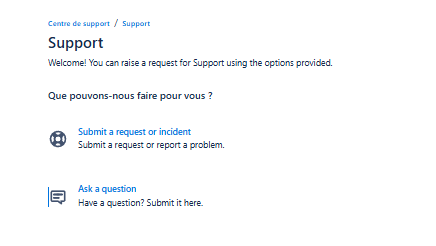
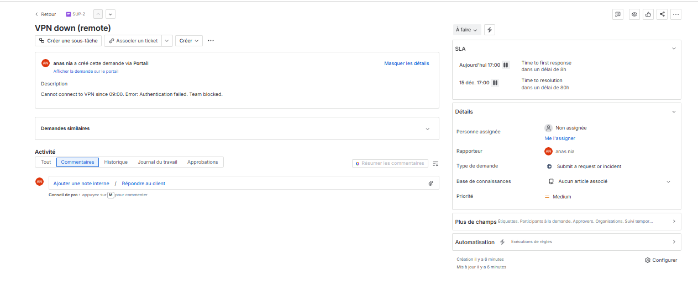
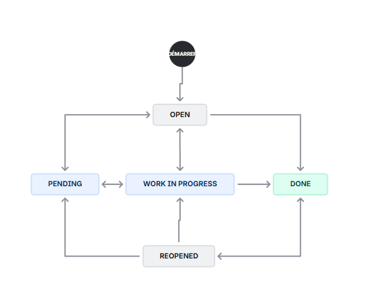
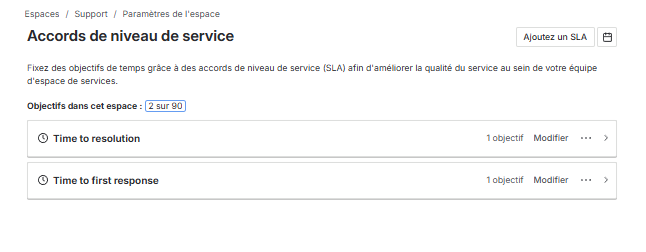
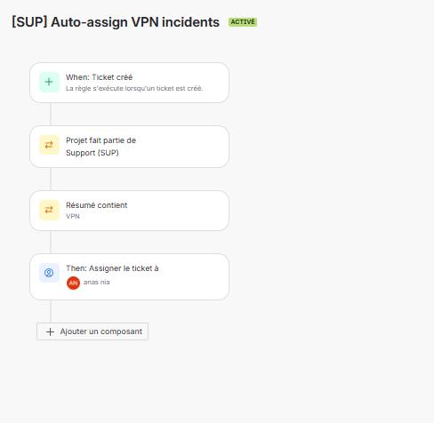
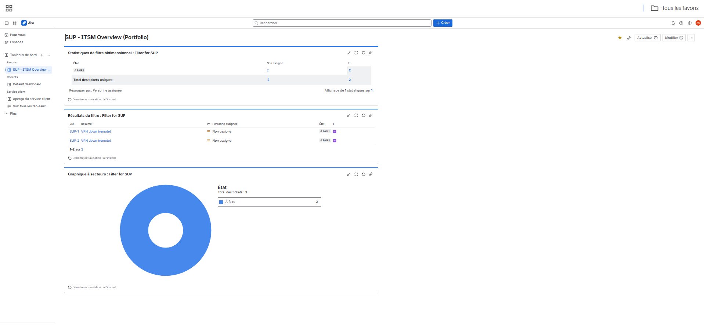

# ITSM Portal Demo (Jira Service Management + Confluence)

FR — Démonstrateur portfolio ITSM réalisé sur Jira Service Management (JSM) + Confluence : portail support, workflows, SLA, automatisations, reporting/dashboard, et documentation (runbook). Objectif : montrer ma capacité à cadrer un process et à le configurer “end-to-end”.

EN — ITSM portfolio demo built with Jira Service Management (JSM) + Confluence: support portal, workflows, SLAs, automations, reporting/dashboard, and documentation (runbook). Goal: demonstrate end-to-end process design + tool configuration.

---

## Scope / Périmètre
- JSM: portal + request types + workflow + SLA + automation + dashboard
- Documentation: ITSM basics + admin runbook + sources

---

## Evidence / Captures (screenshots)

| # | Item | Proof |
|---|------|------|
| 01 | Customer portal |  |
| 02 | Sample ticket |  |
| 03 | Roles & access |  |
| 04 | SLA setup |  |
| 05 | Automation rule |  |
| 06 | Dashboard |  |

---

## Key features (what this demonstrates)
- ITSM concepts: incident/request/change, prioritization and escalation
- Workflow design and implementation
- SLA definition (first response / resolution) + tracking
- Automation rules (routing/auto-assign)
- Reporting & dashboarding
- Admin runbook + naming conventions

---

## Documents
- `docs/itsm-basics.md` — ITSM notions de base
- `docs/runbook-admin.md` — Runbook admin (how-to + conventions)
- `docs/sources.md` — Sources & references (anti-plagiarism)

---

## Notes
This repo contains a demo configuration and documentation. No confidential data.
